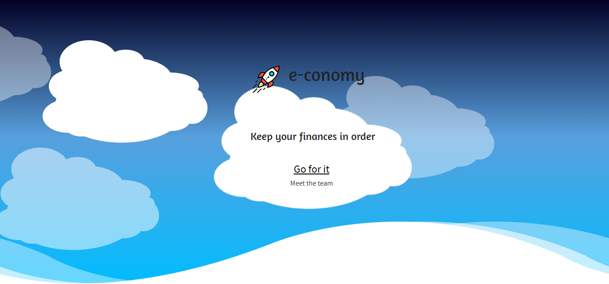
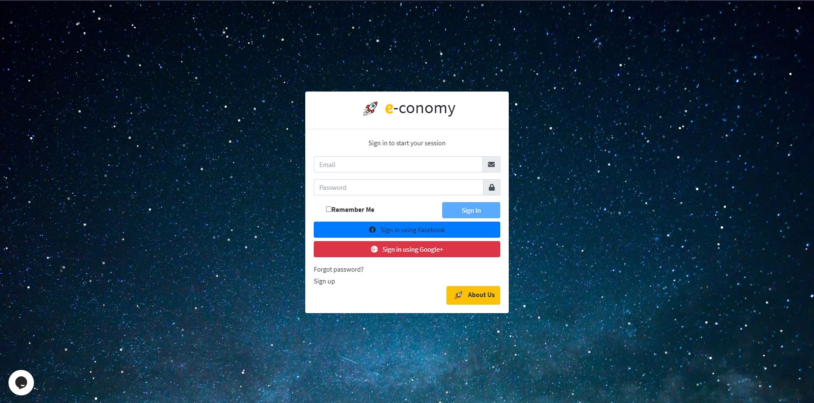
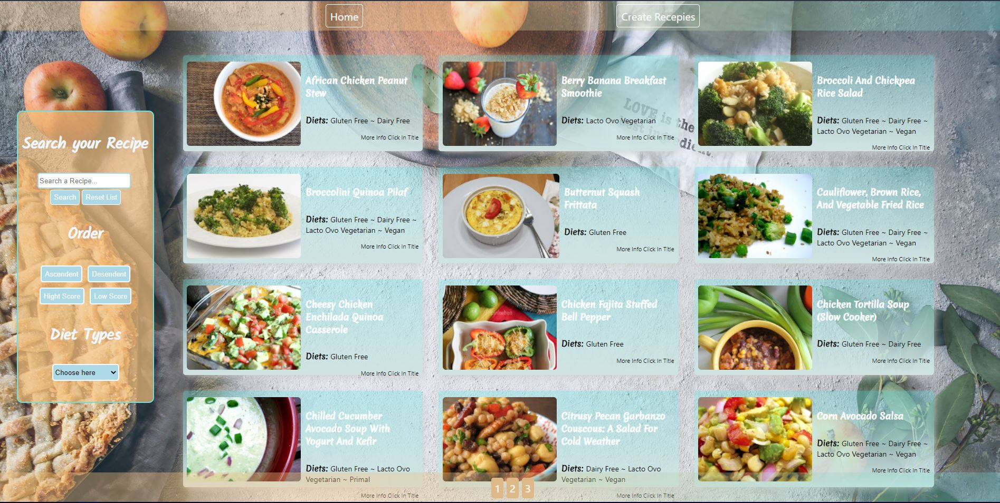
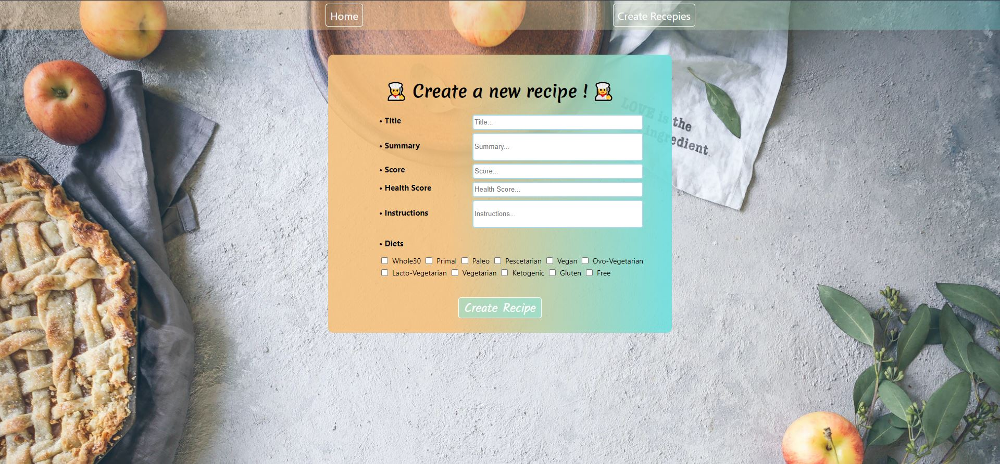

<h1 align="center">Hi 👋, I'm Jorge Ignacio</h1>
<h3 align="center">Web designer and Full-Stack Developer, Front-end lover.</h3>

- 🌱 I’m graduated as Full-Stack Developer!**

- 👯 I’m looking to collaborate on **challenging tasks**

- 👨‍💻 All of my projects are available at [https://viozhu.github.io/](https://viozhu.github.io/)

- 💬 Ask me about **anything Im here 😁**

- 📫 How to reach me **garayjorgeignacio@gmail.com**

<h3 align="center">Connect with me:</h3>

    
    
    

<h3 align="left">Languages and Tools:</h3>

                

&nbsp;

 
<h1 align='center'> e-conomy 💵<h1>
 

<h3 align='center'>
<b> Project e-conomy (finnance and e-comerce app)  Front-end</b>   
Made with React, Redux, Js , bootstrap, CSS and HTML</h3>

 
<h1 align='center'> 👩‍🍳 Be your Own Chef 👨‍🍳<h1>
 

<h3 align='center'>
<b> Project full stack ~ Front-end , Back-End and DB</b>   
Made with React, Redux, Js , Express, Sequelize - Postgres, CSS and HTML</h3>

 
<h1 align='center'> Weather App ⛅<h1> 

<h3 align='center'>
<b> Project Front-End </b>  
 
Made with React, Redux, Css and Html 
   <a href='https://weather-app-viozhu.netlify.app/'>Check it!<a/> </h3>

